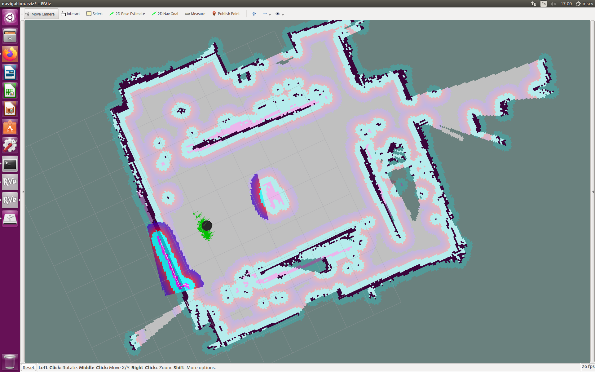

# Factory Robot - Autonomous Navigated Robot with QR Code Detection

Factory Robot is an implementation of Autonomous Navigated Robot with QR Code Detection and Visual Servoing. The implementation consists of different navigation approaches. During the implementation has been used [ROS Joystick](https://github.com/georgealexakis/ros-joystick).

## Table of Contents

[Requirements](#requirements)

[Getting Started](#getting-Started)

[Execution](#execution)

[Screenshots](#screenshots)

[Demos](#demos)

[License](#license)

## Requirements

Below is presented the software and hardware that this implementation has been tested.

### Software

* ROS Kinetic
* Ubuntu 16.04

### Hardware

Turtlebot 2 equipped with:
* Kobuki base
* Microsoft Kinect V1 Xbox 360
* RpLidar
* Generic Router

## Getting Started

### Download the Source of Project

Navigate to catkin_ws/src

``` $ cd ~/catkin_ws/src ```

Get a copy of the source and build it

```
$ git clone https://github.com/georgealexakis/factory_robot.git (master branch)
$ cd ~/catkin_ws
$ catkin_make
```

### Required Packages Installation

Install turtlebot package, navigation package and 3d reconstruction package with the commands below:

```
$ sudo apt-get install ros-kinetic-turtlebot-bringup
$ sudo apt-get install ros-kinetic-turtlebot-navigation
$ sudo apt-get install ros-kinetic-rtabmap-ros
```

Install visp package that is required for tag detection with the commands below:

```
$ sudo apt-get install ros-kinetic-visp-auto-tracker
$ sudo apt-get install ros-kinetic-vision-visp (complete stack)
$ sudo apt-get install ros-kinetic-visp (include all visp packages)
```

Install RGB-D camera sensor (Kinect V1) drivers and package with the commands below:

```
$ sudo apt-get install libfreenect-dev (Kinect V1 sensor drivers)
$ sudo apt-get install ros-kinetic-freenect-launch
```

Install rosbridge packages that enable the communication between the robot and remote controller, such as ROS Joystick with the commands below:

``` $ sudo apt-get install ros-kinetic-rosbridge-server ```

## Execution

### 2d Mapping

Start mapping by running the command below. Then you have to navigate the robot all over the place you want to map.

``` $ roslaunch factory_robot map_building.launch ```

To view the map run:

``` $ roslaunch turtlebot_rviz_launchers view_navigation.launch ``` (run on workstation for visualization only, not obligatory)

When mapping process finishes, run to save the map files in /tmp folder with file name “my_map” in the project folder:

``` $ rosrun map_server map_saver –f /tmp/my_map ```

### 3d Mapping

Start 3d mapping by running the command below. Then you have to navigate the robot to allover the place you want to map.

``` $ roslaunch factory_robot 3d_reconstruction_mapping.launch ```

To view the map run:

``` $ roslaunch rtabmap_ros demo_turtlebot_rviz.launch ``` (run on workstation for visualization only, not obligatory)

When mapping process finish, the map database will be saved to “~/factory_robot/maps/ros/rtabmap.db" folder.

### Robot Positioning and Orientation

Put the QR Code tags to the right positions as presented below. Every tag represents one position in the map. Below are presented the position of every tag and the schematic of a simulation. It is able to create any different simulation by changing the tag in the map.

1. qr1 is initial position (number 1).
2. qr2 is opposite from qr1 position (number 2).
3. qr3 is left from qr1 position (number 3).
4. qr4 is right from qr1 position (number 4).


Put the robot to the initial position before run any command. It is necessary for localization. The initial position and orientation is presented below as the project is developed in the Robotics Lab :

<p align="center">
    
    
    
</p>

### Autonomous Navigation to Specific Positions

Run one of the commands below to start all robot procedures. The first command uses actionlib for autonomous navigation and the second does not.
For these functionalitites, 4 positions have being imported in [/config/coordinates.yaml](https://github.com/georgealexakis/factory_robot/tree/master/config) and [/config/3d_coordinates.yaml](https://github.com/georgealexakis/factory_robot/tree/master/config) files for 4 different QR code tag "qr1, qr2, qr3, qr4".
Edit [/config/coordinates.yaml](https://github.com/georgealexakis/factory_robot/tree/master/config) and [/config/3d_coordinates.yaml](https://github.com/georgealexakis/factory_robot/tree/master/config) for different map.

``` $ roslaunch factory_robot factory.launch ```

or

``` $ roslaunch factory_robot factory_noactionlib.launch ``` (without actionlib)

or for 3d map navigation

``` $ roslaunch factory_robot factory_3d_reconstruction.launch ``` (with actionlib)

### Visual Servoing

For, visual servoing part is not necessary to have a specific map and specific position. Just a specific tag with "qr5" integrated information and black boundary. You can use a second Turtlebot 2 to carry the QR code tag. Run the command below to enable remote controlling to a second Turtlebot 2 and attach the tag on it.

``` $ roslaunch factory_robot servoing_parent.launch ```

Below is presented a demo scenario of visual servoing in the Robotics Lab.


### QR Code Tags

The used QR code tags for the demo implementation are located in the folder [/QRcodetags](https://github.com/georgealexakis/factory_robot/tree/master/QRcodetags) folder. Print to A4 size.

## Screenshots




## Demos

[Autonomous Navigation Demo with QR Code Tag Triggering.](https://1drv.ms/v/s!Amy4EDOPS0vX2Rkr8BAxNO0VNxk9?e=3aWCRT)

[Autonomous Navigation Demo with ROS Joystick Triggering.](https://1drv.ms/v/s!Amy4EDOPS0vX2RjTbNQ9g9B2cD6k?e=nv1mh8)

[Visual Servoing Demo.](https://1drv.ms/v/s!Amy4EDOPS0vX2RdZTmY21WDtKqks?e=ScvSUZ)

## License

This project is licensed under the MIT License - see the [LICENSE](LICENSE) file for details.


